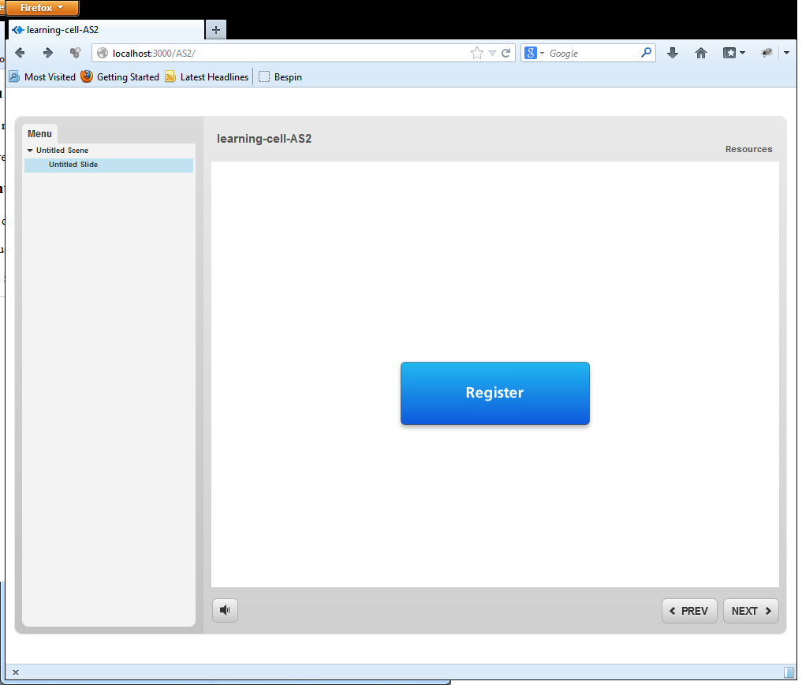
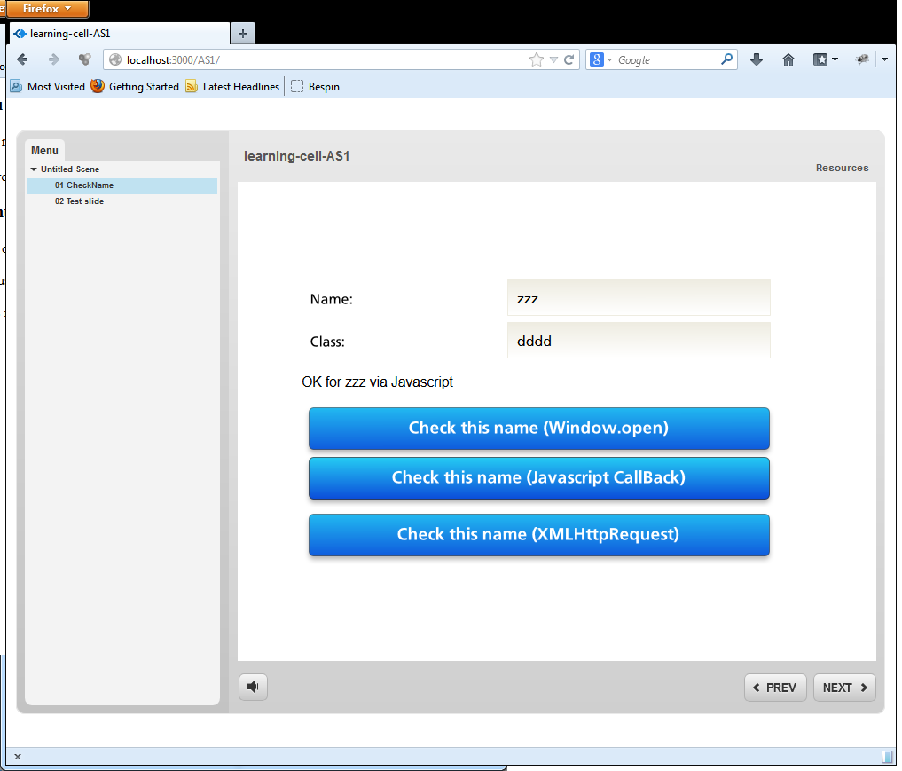

learning-cell
=============

Boilerplate Node server full JavaScript for hosting Kneaver Apps, Courses , Storyline, xAPI

How to use it:

1. Download and install Node.js from http://nodejs.org/download/
2. Clone the project (or fork, or download and unzip )
3. Open a shell and cd to this last directory (Open cmd here can be used)
4. type "npm install" this will install the necessary components
5. type "node app.js" when you want to start the application (startexample.bat can also be used)
6. browse to http://localhost:3000 with the browser of your choice

You might as well install it on heroku.com or nitrous.io

You will need to enter the information for an LRS if you want to use the xAPI features
You will need to enter the information for twitter API if you want to use Twitter API

As is the app features two simple stories

AS1 will have two slides

First one will let you test a name with three different methods

- by opening a new window
- by calling a client side piece of javascript
- by doing a callback on the application. this last case offers the most capabilities.

Second slide is just for the sake of being there

AS2 will have one slide with a big register button on it

This button will bring you to the register page on twitter where you will be prompt to authorize the application to use your account. When it is done an xAPI statement will be prepared and sent to the LRS.

